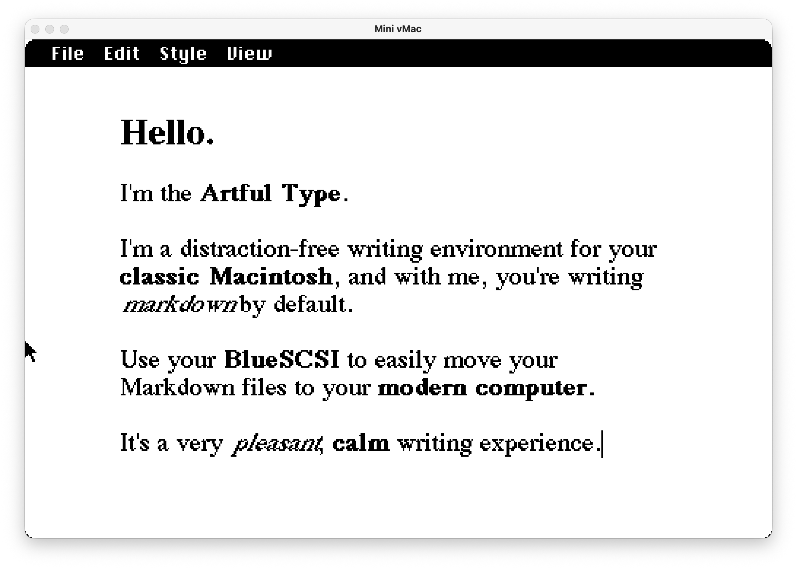
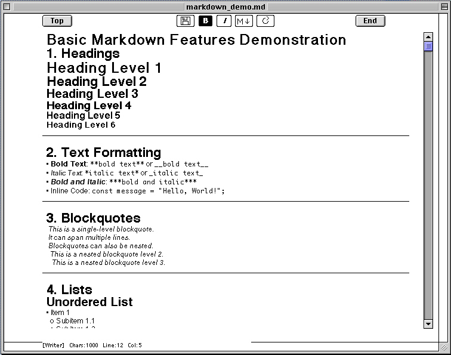
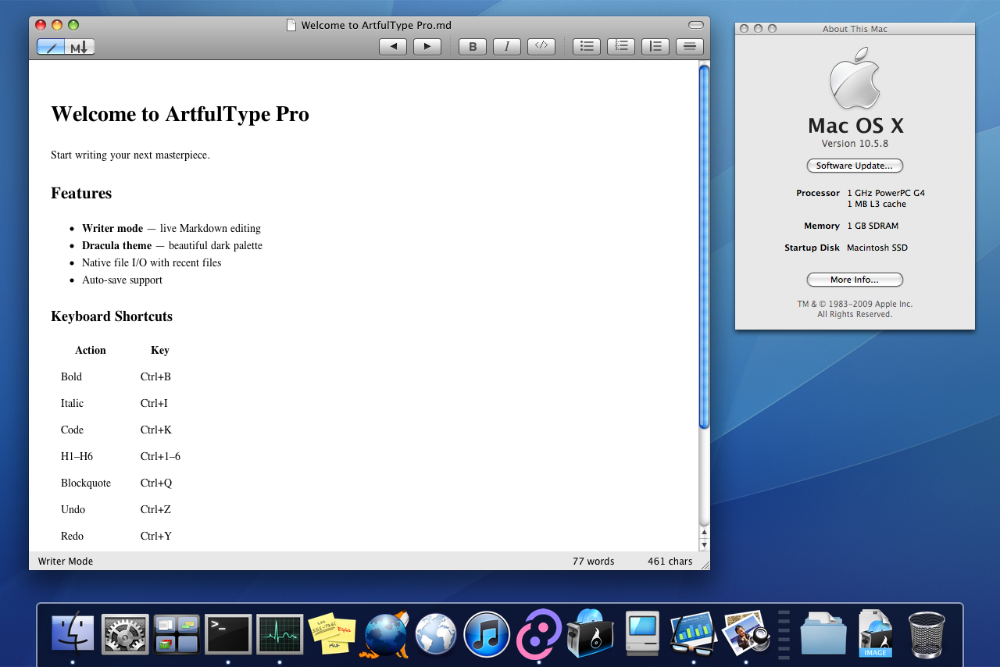

# ArtfulType

> 🚀 **Looking for modern Linux, Windows, or macOS versions?**  
> All modern versions built in Rust (including the Tauri GUI application and the `art` terminal TUI editor) have moved to the dedicated **[ArtfulTypePro](https://github.com/darkcruix2/ArtfulTypePro)** repository!  
> **👉 Visit [github.com/darkcruix2/ArtfulTypePro](https://github.com/darkcruix2/ArtfulTypePro) for modern desktop & terminal downloads.**

---

A distraction-free Markdown writing app for classic 68k Macintosh computers (System 6/7) and Mac OS X PowerPC (10.5 Leopard).



## Features

- **Writer mode** — live Markdown-to-rich-text formatting as you type (bold, italic, code, headings, links)
- **Markdown mode** — plain raw-syntax editing
- Links: type `[text](url)` inline, or select text and use Style → Link
- Cut/Copy/Paste and multi-level Undo/Redo, with standard keyboard shortcuts
- Adjustable zoom, remembered between launches
- Save/Open plain Markdown files via the classic File Manager

Video overview: [Artful Type demo](https://youtu.be/HEheu_r9UGw)

---

## ArtfulType Pro (Classic 68k Macintosh)

A version of ArtfulType for classic Macintosh computers requiring at least a 16MHz 68030 (SE/30), 16 MB of RAM, and Mac OS 7.1 or later.



### Additional Features of the "Pro" 68k Version

- Multi-file support — open multiple Markdown files simultaneously
- Maximum file size increased to 256K
- Bullet point lists & numbered lists
- Resizable windows & status bar
- Icon bar for text formatting and view toggles
- Expanded Style menu
- Markdown view line numbers
- Navigation keyboard shortcuts (Jump to start/end of line or document)

### Classic Mac (68k) Release Downloads

Pre-built binaries for 68k Mac OS are available in the `releases/` directory:

- **MacBinary**: [releases/ArtfulTypePro.bin](releases/ArtfulTypePro.bin)
- **Bootable Floppy Image**: [releases/ArtfulTypePro.dsk](releases/ArtfulTypePro.dsk)

---

## Getting Started (68k Mac)

If your Mac can use [BlueSCSI](https://bluescsi.com), use the BlueSCSI image. If it can't (or you just want a physical floppy), use the 800K floppy image instead.

### Real hardware with BlueSCSI

1. Copy `HD1_ArtfulType.hda` onto your BlueSCSI SD card — the `HD1_` prefix is BlueSCSI's naming convention for assigning an image to SCSI ID 1.
2. Boot the Mac. Double-click ArtfulType to launch it.
3. To write a physical 800K floppy: open `Utilities/Disk Copy 4.2` on the disk image and write `ArtfulType 800K` to a blank floppy.

### Real hardware without BlueSCSI

Write `ArtfulType-800K.dsk` to a real 800K floppy disk and boot from it directly.

### In an emulator (Mini vMac)

Use [Mini vMac](https://www.gryphel.com/c/minivmac/) configured for a Mac Plus:

- `ArtfulType-20MB.dsk` — full HD setup (System 7.1 with the app, Disk Copy, and embedded floppy image)
- `ArtfulType-800K.dsk` — bootable 800K floppy (System 6.0.8) with just the app

---

## Keyboard Shortcuts (Classic Mac)

| Action | Shortcut |
| --- | --- |
| New / Open / Save | ⌘N / ⌘O / ⌘S |
| Quit | ⌘Q |
| Undo / Redo | ⌘Z / ⇧⌘Z |
| Cut / Copy / Paste | ⌘X / ⌘C / ⌘V |
| Bold / Italic / Code / Highlight | ⌘B / ⌘I / ⌘K / ⌘H |
| Subscript / Superscript | ⇧⌘B / ⇧⌘P |
| Admonition Callout | ⇧⌘A |
| Heading 1 / 2 / 3 | ⌘1 / ⌘2 / ⌘3 |
| Link | ⌘L |
| Zoom In / Out / Default | ⌘= / ⌘- / ⌘0 |

---

## Building Classic 68k Version

Built with [Retro68](https://github.com/autc04/Retro68), a GCC-based cross-compiler for classic Mac OS. See `app/CMakeLists.txt` for the build configuration.

---

## Mac OS X (PowerPC) — Leopard Edition

A native Objective-C / WebKit version of ArtfulType for **Mac OS X 10.5 Leopard on PowerPC** hardware (G4/G5).  
Compiled with GCC/Cocoa — no Xcode required. Runs smoothly on PowerPC G4 hardware.



### Leopard Edition Features

- Native Aqua toolbar with icon buttons (Bold, Italic, Code, Lists, Blockquote, Horizontal Rule)
- Writer mode (rich-text live preview) and Markdown mode toggled via segmented control
- Full read/write support for `.md` files
- Undo/Redo, word/character count status bar
- Built-in Marked.js renderer for Markdown preview

### PowerPC Downloads

- **Mac OS X 10.5+ PowerPC Zip**: [releases/ArtfulType-1.0-macOS-PowerPC.zip](releases/ArtfulType-1.0-macOS-PowerPC.zip)

### Building Leopard Edition from Source

```bash
cd ArtfulType-ObjC
make
open build/ArtfulType.app
```

---

## Modern Versions (Linux, Windows, macOS ARM64)

For modern cross-platform GUI & terminal TUI versions, visit **[ArtfulTypePro](https://github.com/darkcruix2/ArtfulTypePro)**.

---

## License

Code: GPLv3 — see [LICENSE](LICENSE).

Creative assets (the ArtfulType name/branding, icon, and artwork): all rights reserved.

---

## AI Disclaimer

Claude Code and Google DeepMind AI tools were used in the creation of this software.
