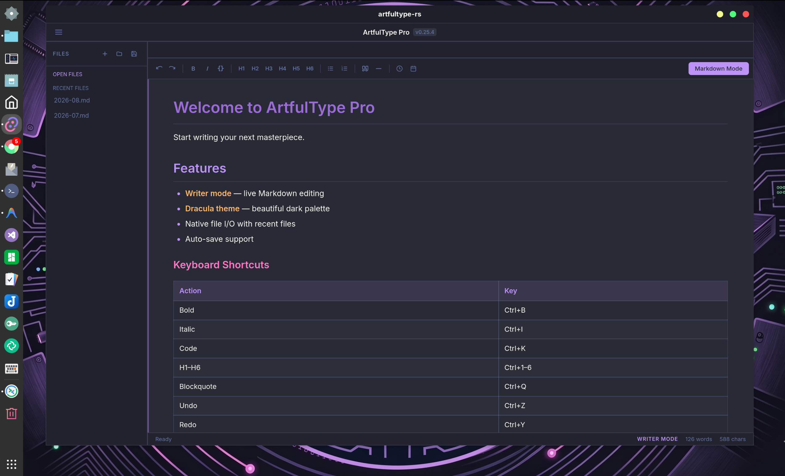

# ArtfulType

A distraction-free Markdown writing app for classic 68k Macintosh computers (System 6/7), built to run from a [BlueSCSI](https://bluescsi.com) device on a Mac Plus or similar compact Mac.


## Features

- **Writer mode** — live Markdown-to-rich-text formatting as you type (bold, italic, code, headings, links)
- **Markdown mode** — plain raw-syntax editing
- Links: type `[text](url)` inline, or select text and use Style → Link
- Cut/Copy/Paste and multi-level Undo/Redo, with standard keyboard shortcuts
- Adjustable zoom, remembered between launches
- Save/Open plain Markdown files via the classic File Manager

Video overview: [Artful Type demo](https://youtu.be/HEheu_r9UGw)

## ArtfulType Pro

A version of ArtfulType that requires at least a 16MHz 68030 (SE/30), 16 MB of RAM, and Mac OS 7.1 or later.


### Additional Features of the "Pro" version

- Multi File Support - you can open multiple markdown files at once
- Maximum file size increased to 256K
- Bullet Point Lists / Numbered Lists
- Resizable windows
- Status Bar
- Icon Bar for text formatting and view change
- Style menu contains more features
- Markdown view contains line numbers
- Shortcuts for navigation, like:
  - CMD + Left     : Jump in front of the first letter of the line
  - CMD + RIGHT    : Jump past the last letter of the line
  - CMD + DOWN     : Jump to the end of the document (There is also a clickable button)
  - CMD + UP       : Jump to the beginning of the document (There is also a clickable button)

### Planned Features

- Full Basic Markdown support (excluding images)
- Print functionality
- Code block to be encapsulated by top and bottom lines
- Blockquote
- Check-Box List

## Getting Started

If your Mac can use [BlueSCSI](https://bluescsi.com), use the BlueSCSI image. If it can't (or you just want a physical floppy), use the 800K floppy image instead.

### Real hardware with BlueSCSI

1. Copy `HD1_ArtfulType.hda` onto your BlueSCSI SD card — the `HD1_` prefix is BlueSCSI's naming convention for assigning an image to SCSI ID 1, so no renaming is needed. (See [BlueSCSI](https://bluescsi.com) for how to set up and image an SD card for your specific BlueSCSI hardware.)
2. Boot the Mac. The Finder will appear as usual — double-click ArtfulType to launch it.
3. To also write a physical 800K floppy: open `Utilities/Disk Copy 4.2` (already on the disk image), and use it to write `ArtfulType 800K` (also already on the disk image, in proper DiskCopy 4.2 format) to a blank floppy in your Mac's floppy drive.

### Real hardware without BlueSCSI

Write `ArtfulType-800K.dsk` to a real 800K floppy disk and boot from it directly — no BlueSCSI required.

### In an emulator (Mini vMac)

For trying ArtfulType without real hardware, use [Mini vMac](https://www.gryphel.com/c/minivmac/) configured for a Mac Plus, with either:

- `ArtfulType-20MB.dsk` — the full HD setup (System 7.1, stripped down, with the app, Disk Copy, and the embedded floppy image)
- `ArtfulType-800K.dsk` — a bootable 800K floppy (System 6.0.8) with just the app

## Usage

ArtfulType has two views, toggled from the View menu:

- **Writer** (default) — markdown syntax is hidden; text is shown styled (bold, italic, headings, etc.)
- **Markdown** — the raw markdown source, unstyled

Saved files are plain `.md` text, editable in any text editor.

### Keyboard shortcuts

| Action | Shortcut |
| --- | --- |
| New / Open / Save | ⌘N / ⌘O / ⌘S |
| Quit | ⌘Q |
| Undo / Redo | ⌘Z / ⇧⌘Z |
| Cut / Copy / Paste | ⌘X / ⌘C / ⌘V |
| Bold / Italic / Code / Highlight | ⌘B / ⌘I / ⌘K / ⌘H |
| Subscript / Superscript | ⇧⌘B / ⇧⌘P |
| Admonition Callout | ⇧⌘A |
| Heading 1 / 2 / 3 | ⌘1 / ⌘2 / ⌘3 |
| Link | ⌘L |
| Zoom In / Out / Default | ⌘= / ⌘- / ⌘0 |

## Building

Built with [Retro68](https://github.com/autc04/Retro68), a GCC-based cross-compiler for classic Mac OS. See `app/CMakeLists.txt` for the build configuration.

## Classic Mac (68k) Versions

The classic 68k version of ArtfulType Pro is available in the `releases/` directory:

- **MacBinary**: [releases/ArtfulTypePro.bin](releases/ArtfulTypePro.bin)
- **Bootable Floppy Image**: [releases/ArtfulTypePro.dsk](releases/ArtfulTypePro.dsk)

## Mac OS X (PowerPC) — Leopard Edition

A native Objective-C / WebKit version of ArtfulType for **Mac OS X 10.5 Leopard on PowerPC** hardware (G4/G5).  
Compiled with GCC/Cocoa — no Xcode required. Runs on as little as a 1 GHz PowerPC G4 with 1 GB of RAM.


### Leopard Edition Features

- Native Aqua toolbar with icon buttons (Bold, Italic, Code, Lists, Blockquote, Horizontal Rule)
- Writer mode (rich-text live preview) and Markdown mode toggled via the ✏ / M↓ segmented control
- Full read/write support for `.md` files
- Undo/Redo, word/character count in the status bar
- Built-in Marked.js renderer for pixel-perfect Markdown preview

### Download

- **Mac OS X 10.5+ PowerPC**: [releases/ArtfulType-1.0-macOS-PowerPC.zip](releases/ArtfulType-1.0-macOS-PowerPC.zip)

### Building from Source

```bash
# On the target Mac (requires GCC + Cocoa + WebKit):
cd ArtfulType-ObjC
make
open build/ArtfulType.app
```

---

## Modern Versions (artfultype-rs)

### Screenshots

**Mac (ARM64)**


**Windows 11**


**Linux (Debian/Gnome)**


Modern companion binaries for macOS, Linux, and Windows are available in the `releases/` directory in this repository:

- **Mac OS X 10.5+ PowerPC**: [releases/ArtfulType-1.0-macOS-PowerPC.zip](releases/ArtfulType-1.0-macOS-PowerPC.zip)
- **Mac (ARM64)**:
  - DMG Installer: [releases/artfultype-rs_0.30.2_aarch64.dmg](releases/artfultype-rs_0.30.2_aarch64.dmg)
  - Application Zip: [releases/artfultype-rs-mac.zip](releases/artfultype-rs-mac.zip)
  - CLI Binary: [releases/artfultype-cli-mac-arm64](releases/artfultype-cli-mac-arm64)
- **Windows (x64)**:
  - Installer: [releases/artfultype-rs_0.30.2_x64-setup.exe](releases/artfultype-rs_0.30.2_x64-setup.exe)
  - Portable Executable: [releases/artfultype-rs-windows-x64.exe](releases/artfultype-rs-windows-x64.exe)
- **Linux (AMD64)**:
  - AppImage: [releases/artfultype-rs_0.30.2_amd64.AppImage](releases/artfultype-rs_0.30.2_amd64.AppImage)
  - Debian Package: [releases/artfultype-rs_0.30.2_amd64.deb](releases/artfultype-rs_0.30.2_amd64.deb)
  - RPM Package: [releases/artfultype-rs-0.30.2-1.x86_64.rpm](releases/artfultype-rs-0.30.2-1.x86_64.rpm)
  - Raw Binary: [releases/artfultype-rs-linux-amd64](releases/artfultype-rs-linux-amd64)

---

## art — Terminal TUI (Linux & macOS)

A distraction-free Markdown & Code editor that runs entirely in the terminal — no GUI required.  
Supports **Writer**, **Markdown**, **Split**, and **Pure Text / Coding** view modes with live Markdown preview, toggleable multi-language syntax highlighting, shift-selection, cut/copy/paste, bold/italic/code wrapping, auto-indentation, line moving/duplication, and VT100/ASCII mode for legacy terminals.


### CLI Features

- **Four view modes**: Writer (styled preview), Markdown (raw editor), Split (side-by-side), Pure Text / Code Mode (`F5` / `-t`)
- **Toggleable Syntax Highlighting**: `F6` or `Ctrl+H` enables/disables real-time syntax highlighting with status bar indication (`[SYNTAX: ON/OFF]`)
- **Auto-Detection**: Automatically launches in Pure Text / Code Mode when opening non-Markdown code files (`.rs`, `.py`, `.c`, `.cpp`, `.js`, `.ts`, `.go`, `.java`, `.sh`, `.json`, `.sql`, etc.)
- **Coding Productivity**:
  - `Tab` / `Shift+Tab`: Indent / Unindent selection or line
  - `Enter`: Smart auto-indentation (carries leading whitespace & expands on `{`, `:`, `(`, `[`)
  - `Ctrl+D`: Duplicate line or selection
  - `Alt+Up` / `Alt+Down`: Move current line UP or DOWN
  - `(` `[` `{` `"` `'` `` ` ``: Wrap selected text in matching delimiters
- **Selection mode**: hold `Shift` + arrow keys to select text in any direction
- **Clipboard**: `Ctrl+C` / `Ctrl+X` / `Ctrl+V`
- **Multiple themes**: Dark Antigravity, Dracula, Retro Green, Retro Amber, DOS Edit, VT100
- **VT100 / ASCII mode** (`--vt100`): pure ASCII borders for legacy or restricted terminals
- **Menu bar**: `Option+Cmd+F/E/O/V/T/H` (or `Alt+F/E/O/V/T/H`) or arrow keys to navigate menus

### CLI Keyboard Shortcuts

| Action | Shortcut |
| --- | --- |
| Writer / MD / Split / Pure Text Mode | `Cmd+Alt+2` / `3` / `4` / `5` (or `F2`–`F5`) |
| Toggle Syntax Highlighting | `Cmd+Alt+6` / `F6` / `Ctrl+H` |
| Save | `Ctrl+S` |
| Quit | `Ctrl+Q` |
| Indent / Unindent | `Tab` / `Shift+Tab` |
| Duplicate Line / Selection | `Ctrl+D` |
| Move Line Up / Down | `Alt+Up` / `Alt+Down` |
| Bold / Italic / Code | `Ctrl+Alt+B` / `Ctrl+Alt+I` / `Ctrl+Alt+K` |
| Heading 1 / 2 / 3 | `Ctrl+1` / `Ctrl+2` / `Ctrl+3` |
| Copy / Cut / Paste | `Ctrl+Alt+C` / `Ctrl+Alt+X` / `Ctrl+Alt+V` |
| Select (extend) | `Shift+Arrow` |
| Clear selection | `Esc` |
| Open menu bar | `Option+Cmd+F` / `E` / `O` / `V` / `T` / `H` (or `Alt+F/E/O/V/T/H`) |

### CLI Downloads (Linux & macOS, v0.30.2)

- **macOS (ARM64 Binary)**: [releases/artfultype-cli-mac-arm64](releases/artfultype-cli-mac-arm64)
- **Debian/Ubuntu `.deb`**: [releases/artfultype-cli_0.30.2-1_amd64.deb](releases/artfultype-cli_0.30.2-1_amd64.deb)
- **RPM (Fedora/RHEL/openSUSE)**: [releases/artfultype-cli-0.30.2-1.x86_64.rpm](releases/artfultype-cli-0.30.2-1.x86_64.rpm)

```bash
# Install .deb (installs /usr/bin/art)
sudo dpkg -i artfultype-cli_0.30.2-1_amd64.deb

# Install .rpm
sudo rpm -i artfultype-cli-0.30.2-1.x86_64.rpm
```

## License

Code: GPLv3 — see [LICENSE](LICENSE).

Creative assets (the ArtfulType name/branding, icon, and artwork): all rights reserved.

## AI Disclaimer

Claude Code was used in the creation of this software.
